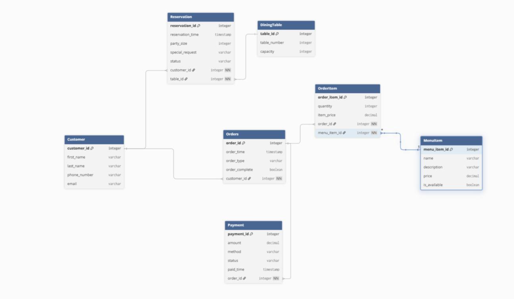
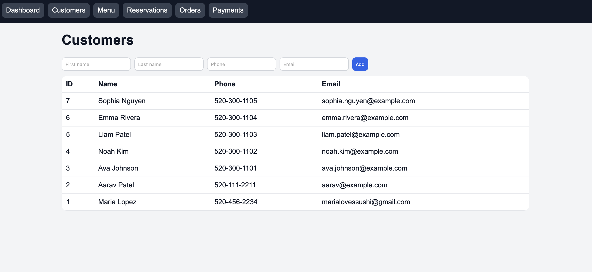
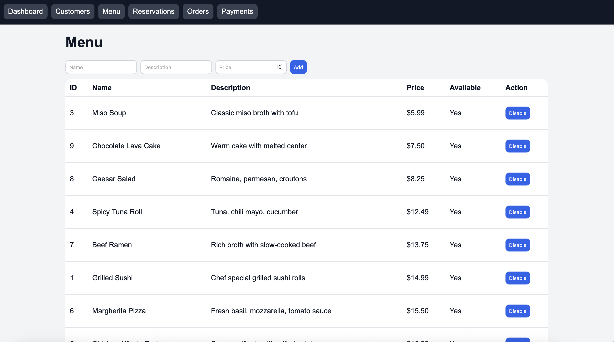
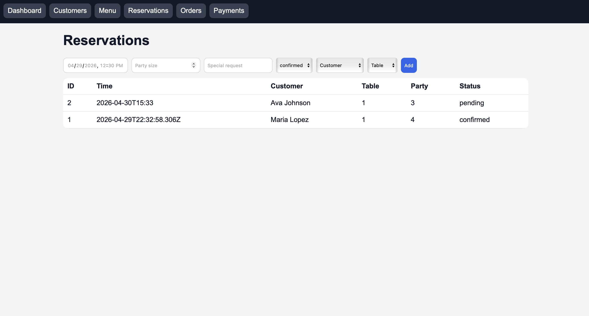
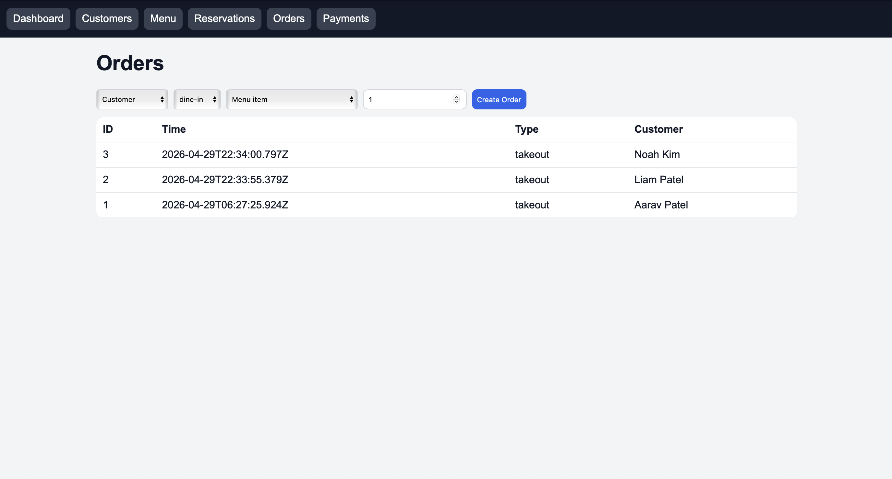
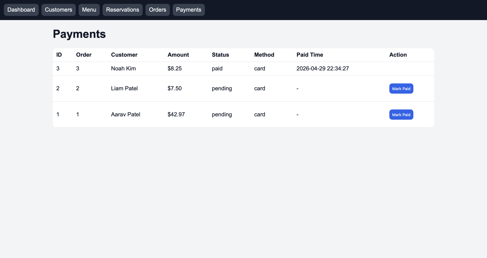

# Restaurant App - Phase 3 Repository

This repository contains Phase 3 of our restaurant web application project and directly represents the Phase 1 requirements and Phase 2 database work.  
It provides a working interface connected to the database design, including entity management, operational workflows, and query-backed functionality for demonstration.

## Files

- `app.js` - complete server + routes + HTML + CSS + database setup
- `package.json` - dependencies and start script
- `README.md` - setup notes
- `new_restaurant.avif` - dashboard image
- `restaurant.db` - SQLite database (auto-created/updated)

## Start

```bash
cd /Users/rianachatterjee/restaurant-phase3-web
npm install
npm start
```

Open:

- `http://localhost:3000`

If port 3000 is busy:

```bash
PORT=3001 npm start
```

## What It Includes

- Dashboard with counts + image
- Customers add/list
- Menu add/list/toggle availability
- Reservations add/list
- Orders create/list
- Payments list + mark paid

## Phase 2 Alignment (Tables + SQL Operations)

This Phase 3 implementation is directly based on the Phase 2 schema and query requirements.

### Tables From Phase 2

The app uses the same core tables:

- `Customer`
- `DiningTable`
- `MenuItem`
- `Reservation`
- `Orders`
- `OrderItem`
- `Payment`

These tables are created in `app.js` and persisted in `restaurant.db`.

### SQL Query Coverage From Phase 2

The application behavior maps to the required SQL categories:

- **INSERT**
  - Add new customers
  - Add new menu items
  - Add reservations
  - Create orders
  - Auto-create payment records for new orders
- **SELECT**
  - Dashboard count queries
  - List all customers, menu items, reservations, orders, and payments
  - Join queries (e.g., orders/payments with customer details)
- **UPDATE**
  - Toggle menu item availability (`is_available`)
  - Mark payment status from pending to paid
- **DELETE**
  - Reservation delete behavior is represented in the project workflow from Phase 2 logic
  - (In this minimal version, the UI is focused on create/list/update flows for demo clarity)

### ER Diagram (From Phase 2)



## Tab-by-Tab Application Walkthrough

Each section below corresponds to a clickable navigation tab in the web application and shows how the UI functionality maps back to Phase 1 requirements and Phase 2 database/query design.

### Dashboard Tab

- **Functionality:** Shows a high-level summary of current system state (counts for customers, menu items, reservations, orders, and payments) with quick navigation cards.
- **Phase 1 relation:** Supports the project goal of providing a usable management interface for restaurant operations.
- **Phase 2 relation:** Uses `SELECT COUNT(*)` queries across the core tables to provide real-time overview metrics.


### Customers Tab

- **Functionality:** Add new customers and list all customer records.
- **Phase 1 relation:** Implements customer information management required for reservations and orders.
- **Phase 2 relation:** Directly maps to the `Customer` table and demonstrates `INSERT` + `SELECT` operations.



### Menu Tab

- **Functionality:** Add menu items, list available items, and toggle item availability.
- **Phase 1 relation:** Supports menu maintenance and operational item availability.
- **Phase 2 relation:** Directly maps to `MenuItem` and demonstrates `INSERT`, `SELECT`, and `UPDATE is_available` operations.



### Reservations Tab

- **Functionality:** Create reservations and view reservation details (time, party size, customer, table, status).
- **Phase 1 relation:** Covers reservation workflow and dining table assignment.
- **Phase 2 relation:** Uses `Reservation` with foreign keys to `Customer` and `DiningTable`, and demonstrates relational `INSERT` + joined `SELECT` queries.



### Orders Tab

- **Functionality:** Create orders by selecting customer, order type, menu item, and quantity; view order history.
- **Phase 1 relation:** Implements order-taking and service flow.
- **Phase 2 relation:** Maps to `Orders` and `OrderItem`, uses linked inserts, and supports relational `SELECT` output.



### Payments Tab

- **Functionality:** Displays payment records and allows pending payments to be marked as paid.
- **Phase 1 relation:** Implements billing/payment completion flow.
- **Phase 2 relation:** Maps to `Payment`, demonstrates joined `SELECT` with order/customer context, and `UPDATE` for payment status transitions.


